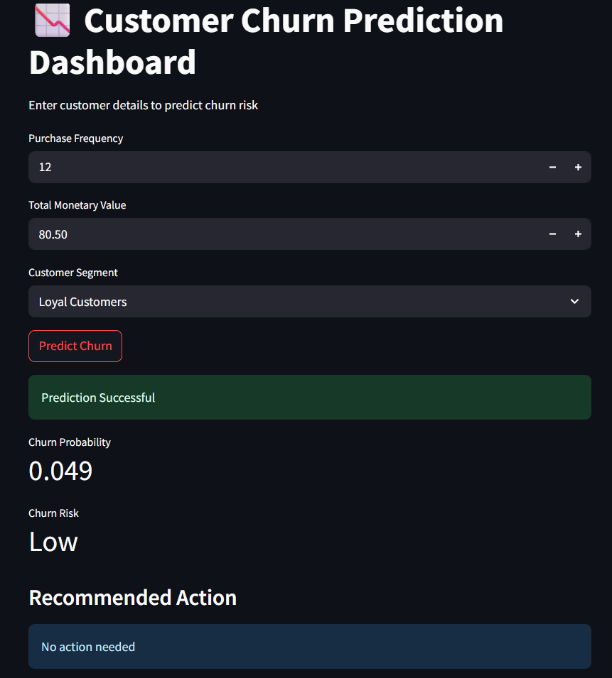
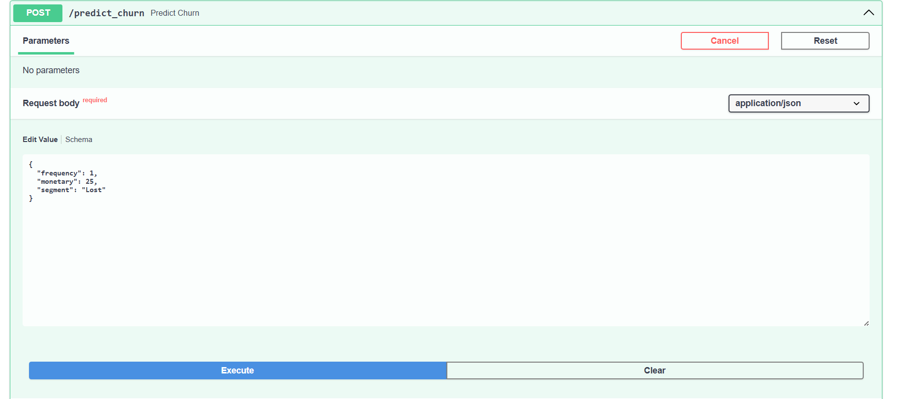
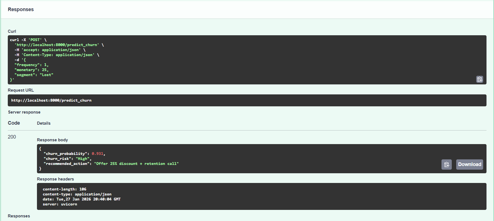

# Customer Intelligence Platform

A full-stack machine learning system for customer segmentation and churn prediction, built on retail transactional data. It combines RFM analysis, a Random Forest churn model, a FastAPI prediction service, and a Streamlit dashboard into a single cohesive pipeline.

---

## Features

- **RFM Segmentation** — Scores customers on Recency, Frequency, and Monetary value, assigning them to segments: Champions, Loyal Customers, Potential Loyalists, At Risk, and Lost.
- **Churn Prediction Model** — A Random Forest classifier trained on RFM features that outputs a churn probability and risk tier (High / Low) for each customer.
- **Business Action Engine** — Rule-based recommendations triggered by churn probability: retention calls with a 25% discount for high-risk customers, personalized email offers for moderate risk, and no action for low risk.
- **REST API** — FastAPI service exposing single and batch prediction endpoints with auto-generated Swagger and ReDoc documentation.
- **Interactive Dashboard** — Streamlit UI for real-time single-customer churn predictions against the live API.

---

## Project Structure

```
customer-intelligence-platform/
├── api/
│   └── main.py                  # FastAPI app (churn prediction endpoints)
├── dashboard/
│   └── app.py                   # Streamlit dashboard
├── data/
│   ├── raw/                     # Raw data drop zone
│   └── processed/
│       └── rfm_segments.csv     # RFM output used for model training
├── Dataset/
│   └── online_retail.csv        # Source transactional dataset
├── models/
│   ├── churn_model.pkl          # Trained Random Forest classifier
│   └── segment_encoder.pkl      # LabelEncoder for customer segments
├── notebooks/
│   ├── 01_customer_segmentation.ipynb   # Full EDA → RFM → model pipeline
│   └── Business-Action-Engine.ipynb     # Action logic prototyping
└── src/
    ├── Dashboard.png            # Dashboard screenshot
    ├── swagger1.png             # API docs screenshot
    └── swagger2.png             # API docs screenshot
```

---

## Quickstart

### 1. Install dependencies

```bash
pip install fastapi uvicorn streamlit pandas scikit-learn joblib numpy requests
```

### 2. Start the API

```bash
cd api
uvicorn main:app --reload
```

The API will be available at `http://127.0.0.1:8000`. Interactive docs at `/docs`.

### 3. Launch the dashboard

Open a second terminal:

```bash
cd dashboard
streamlit run app.py
```

> The dashboard connects to the FastAPI backend at `http://127.0.0.1:8000`, so the API must be running first.

---

## API Reference

### `POST /predict_churn`

Single-customer prediction.

**Request body:**
```json
{
  "frequency": 5,
  "monetary": 320.50,
  "segment": "At Risk"
}
```

**Response:**
```json
{
  "churn_probability": 0.823,
  "churn_risk": "High",
  "recommended_action": "Offer 25% discount + retention call"
}
```

Valid `segment` values: `Champions`, `Loyal Customers`, `Potential Loyalist`, `At Risk`, `Lost`.

---

### `POST /predict_churn_batch`

Batch prediction from a CSV file upload. The CSV must contain columns: `frequency`, `monetary`, `segment`.

**Response:** JSON array with the original rows plus `churn_probability`, `churn_risk`, and `recommended_action` appended.

---

### `GET /`

Health check — returns `{"message": "Customer Churn Prediction API is running"}`.

---

## ML Pipeline

The full pipeline is documented in `notebooks/01_customer_segmentation.ipynb`.

**Data preparation:**
- Load raw transactional data (`online_retail.csv`).
- Drop rows with missing `CustomerID`; filter out negative quantities and zero unit prices.
- Compute `TotalAmount = Quantity × UnitPrice`.

**RFM scoring:**
- Recency — days since last purchase relative to a snapshot date.
- Frequency — number of unique invoices.
- Monetary — total spend.
- Each dimension is quartile-scored (1–4); scores are concatenated into an RFM string and mapped to a named segment.

**Churn labeling:**
- A customer is labeled churned (`Churn = 1`) if their recency exceeds 90 days.

**Model training:**
- Features: `Frequency`, `Monetary`, `Segment_encoded` (label-encoded).
- Model: `RandomForestClassifier(n_estimators=200, max_depth=6)`.
- Evaluation: classification report + ROC-AUC score.
- Serialized with `joblib` to `models/churn_model.pkl` and `models/segment_encoder.pkl`.

---

## Business Action Engine

| Churn Probability | Risk Tier | Recommended Action                        |
|:-----------------:|:---------:|-------------------------------------------|
| ≥ 0.75            | High      | Offer 25% discount + retention call       |
| 0.50 – 0.74       | High      | Send personalized email offer             |
| < 0.50            | Low       | No action needed                          |

---

## Screenshots

**Dashboard**



**API Docs**




---

## Dataset

The project uses the [Online Retail dataset](https://archive.ics.uci.edu/dataset/352/online+retail) from the UCI Machine Learning Repository — UK-based online retail transactions from 2010–2011.
